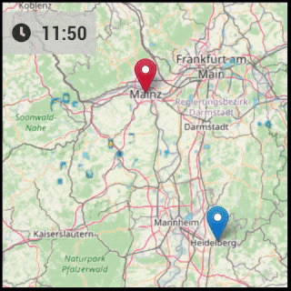

# MMM-RAIN-MAP

A Rain Radar Map for [Magic Mirror](https://magicmirror.builders/) based on the [Rainviewer API](https://github.com/rainviewer/rainviewer-api-example).  
Click here for the [Forum Thread](https://forum.magicmirror.builders/topic/12808/mmm-rain-map).

#### Support
If you like this module and want to thank, please buy me a beer.

<a href="https://www.buymeacoffee.com/jalibu" target="_blank"></a>

## Features

- Displays Rainviewer.com radar layers on OpenStreetMap
- Option to support multiple, alternating markers and zoom levels  
- **Important note:** The underlaying RainViewer.com free plan only supports history data. This is **no forecast**!  


## Installing the Module

- Navigate to the MagicMirror subfolder "modules" and execute the following command

```sh
git clone https://github.com/jalibu/MMM-RAIN-MAP.git
```

- Add the module in the `config/config.js` file:

### Sample configuration

```javascript
{
	module: "MMM-RAIN-MAP",
	position: "top_left",
	config: {
		animationSpeedMs: 600,
		defaultZoomLevel: 8,
		displayTime: true,
		displayClockSymbol: true,
		extraDelayLastFrameMs: 2000,
		markers: [
			{ lat: 49.410, lng: 8.717, zoom: 9, color: "red", hidden: false },
			{ lat: 49.410, lng: 8.717, zoom: 5, hidden: true },
		],
		markerChangeInterval: 0,
		mapUrl: "https://{s}.tile.openstreetmap.org/{z}/{x}/{y}.png",
		mapHeight: "420px",
		mapWidth: "420px",
		updateIntervalInSeconds: 300,
	}
}
```

## Options

| Option                  | Description                                                                                                                                                                                                |
| ----------------------- | ---------------------------------------------------------------------------------------------------------------------------------------------------------------------------------------------------------- |
| `animationSpeedMs`      | Determines how fast the frames are played. <br><br>**Type:** `number` <br> **Default value:** `600` (time per frame in milliseconds)                                                                          |
| `defaultZoomLevel`      | Map zoom value. <br><br>**Type:** `number` <br> **Default value:** `8`                                                                                                                                    |
| `displayTime`           | Display the time for each frame. <br><br>**Type:** `boolean` <br> **Default value:** `true`                                                                                                                |
| `displayClockSymbol`    | Display clock symbol as time prefix. <br><br>**Type:** `boolean` <br> **Default value:** `true`                                                                                                            |
| `extraDelayLastFrameMs` | Add an extra delay to pause the animation on the latest frame.<br><br>**Type:** `int` <br> **Default value:** `2000` (time in milliseconds)                                                                |
| `mapHeight`             | Height of the map. <br><br>**Type:** `string` (pixels) <br> **Default value:** `'420px'`                                                                                                                   |
| `mapWidth`              | Width of the map. <br><br>**Type:** `string` (pixels) <br> **Default value:** `'420px'`                                                                                                                    |
| `markers`               | **Required:** Array of markers or center-points in the map.<br> See examples and Markers-Object documentation below for details. <br><br>**Type:** `array[Markers]` <br> **Default value:** `[]`           |
| `markerChangeInterval`  | If you have more than one marker and set this to a value higher than 0, the map jumps from marker to marker after the given number of intervals. <br><br>**Type:** `number` <br> **Default value:** `0` (off) |
| `timeFormat`            | Option to override the Magic Mirror's global the time format to 12 or 24 for this module. <br><br>**Type:** `number` <br> **Default value:** `[Global Config]` or `24`                                        |
| `updateIntervalMs`      | Update interval for fetching new radar frames. (New frames are released every 10 minutes) <br><br>**Type:** `number` <br> **Default value:** `300000` (time in milliseconds)                                  |

### Markers Object

| Option   | Description                                                                                                                                                                    |
| -------- | ------------------------------------------------------------------------------------------------------------------------------------------------------------------------------ |
| `lat`    | **Required:** Markers latitude.<br><br>**Type:** `float`                                                                                                                       |
| `lng`    | **Required:** Markers longitude.<br><br>**Type:** `float`                                                                                                                      |
| `zoom`   | Set individual zoom level for marker-jumping mode.<br><br>**Type:** `number`  0-20                                                                                                    |
| `color`  | Possible colors: `'black','blue','gold','green','grey','orange','red','violet','yellow'`<br><br>**Type:** `string` |
| `hidden` | Hide this marker on map. (i.e. if it should just be a jump-point)<br><br>**Type:** `boolean`                                                                                    |

## Thanks to

- All testers for their feedback
- [MMM-RAIN-RADAR by jojoduquartier](https://github.com/jojoduquartier/MMM-RAIN-RADAR) for inspiration
