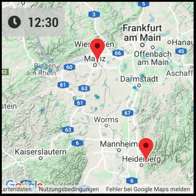

# MMM-RAIN-MAP

A Rain Radar Map for [Magic Mirror](https://magicmirror.builders/) based on the [Rainviewer API](https://github.com/rainviewer/rainviewer-api-example).  
Click here for the [Forum Thread](https://forum.magicmirror.builders/topic/12808/mmm-rain-map).

## Features

- Shows Rainviewer.com rain data on OpenStreetMap or Google Maps
- Option to support multiple, alternating zoom levels
- Option to only show on rain (dependency to currentweather module)
- Option to add markers on map
- OpenStreetMap vs. Google Maps  
   

## Installing the Module

- Navigate to the MagicMirror subfolder "modules" and execute the following command

```sh
git clone https://github.com/jalibu/MMM-RAIN-MAP.git
```

- Add the module in the `config/config.js` file:

### Sample configuration (OpenStreetMap)

```javascript
{
	module: "MMM-RAIN-MAP",
	position: "top_left",
	config: {
		animationSpeedMs: 600,
		defaultZoomLevel: 5,
		displayClockSymbol: true,
		displayOnRainOnly: false,
		displayTime: true,
		extraDelayLastFrameMs: 2000,
		map: "OSM",
		mapHeight: "420px",
		mapWidth: "420px",
		markers: [
			{ lat: 50, lng: 8.27, hidden: false, zoom: 5, color: "red", },
			{ lat: 50, lng: 8.27, hidden: true, zoom: 8}
		],
		markerChangeInterval: 3,
		overlayOpacity: 0.65,
		timeFormat: 24,
		updateIntervalMs: 300000,
	}
}
```

### Sample configuration (Google Maps)

```javascript
{
	module: "MMM-RAIN-MAP",
	position: "top_left",
	config: {
		animationSpeedMs: 600,
		defaultZoomLevel: 5,
		displayClockSymbol: true,
		displayOnRainOnly: false,
		displayTime: true,
		extraDelayLastFrameMs: 2000,
		googleBackgroundColor: "rgba(0, 0, 0, 0)",
		googleDisableDefaultUI: true,
		googleKey: "<INSERT_HERE>",
		googleMapTypeId: "terrain",
		map: "GOOGLE",
		mapHeight: "420px",
		mapWidth: "420px",
		markers: [
			{ lat: 50, lng: 8.27, hidden: false, zoom: 5},
			{ lat: 50, lng: 8.27, hidden: true, zoom: 8}
		],
		markerChangeInterval: 3,
		overlayOpacity: 0.65,
		timeFormat: 24,
		updateIntervalMs: 300000,
	}
}
```

## Options

### General options

| Option                  | Description                                                                                                                                                                                                |
| ----------------------- | ---------------------------------------------------------------------------------------------------------------------------------------------------------------------------------------------------------- |
| `animationSpeed`        | Determines how fast the frames are played. <br><br>**Type:** `int` <br> **Default value:** `600` (time per frame in milliseconds)                                                                          |
| `defaultZoomLevel`      | Map zoom value. <br><br>**Type:** `integer` <br> **Default value:** `8`                                                                                                                                    |
| `displayTime`           | Display the time for each frame. <br><br>**Type:** `boolean` <br> **Default value:** `true`                                                                                                                |
| `displayClockSymbol`    | Display clock symbol as time prefix. <br><br>**Type:** `boolean` <br> **Default value:** `true`                                                                                                            |
| `displayOnRainOnly`     | If set to true, the map is only displayed when `currentweather module` shows rain or snow icon. <br><br>**Type:** `boolean` <br> **Default value:** `false`                                                |
| `extraDelayLastFrameMs` | Add an extra delay to pause the animation on the latest frame.<br><br>**Type:** `int` <br> **Default value:** `2000` (time in milliseconds)                                                                |
| `map`                   | Used Map API <br>Possible values: `'GOOGLE'` or `'OSM'` <br><br>**Type:** `string` <br> **Default value:** `'OSM'`                                                                                         |
| `mapHeight`             | Height of the map. <br><br>**Type:** `string` (pixels) <br> **Default value:** `'420px'`                                                                                                                   |
| `mapWidth`              | Width of the map. <br><br>**Type:** `string` (pixels) <br> **Default value:** `'420px'`                                                                                                                    |
| `markers`               | **Required:** Array of markers or center-points in the map.<br> See examples and Markers-Object documentation below for details. <br><br>**Type:** `array[Markers]` <br> **Default value:** `[]`           |
| `markerChangeInterval`  | If you have more than one marker and set this to a value higher than 0, the map jumps from marker to marker after the given number of intervals. <br><br>**Type:** `int` <br> **Default value:** `0` (off) |
| `overlayOpacity`        | Opacity of radar overlay on map. <br><br>**Type:** `float` <br> **Default value:** `0.6`                                                                                                                   |
| `timeFormat`            | Option to override the Magic Mirror's global the time format to 12 or 24 for this module. <br><br>**Type:** `int` <br> **Default value:** `[Global Config]` or `24`                                        |
| `updateIntervalMs`      | Update interval for fetching new radar frames. (New frames are released every 10 minutes) <br><br>**Type:** `int` <br> **Default value:** `300000` (time in milliseconds)                                  |

### Markers Object

| Option   | Description                                                                                                                                                                    |
| -------- | ------------------------------------------------------------------------------------------------------------------------------------------------------------------------------ |
| `lat`    | **Required:** Markers latitude.<br><br>**Type:** `float`                                                                                                                       |
| `lng`    | **Required:** Markers longitude.<br><br>**Type:** `float`                                                                                                                      |
| `zoom`   | Set individual zoom level for marker-jumping mode.<br><br>**Type:** `int`                                                                                                      |
| `color`  | Possible colors: `'black','blue','gold','green','grey','orange','red','violet','yellow'`<br> Note: The color property only works with OpenStreetMap.<br><br>**Type:** `string` |
| `hidden` | Hide this marker on map (i.e. if it should just be a jump-point.<br><br>**Type:** `boolean`                                                                                    |

### Google Maps only options

| Option                   | Description                                                                                                                                                                                        |
| ------------------------ | -------------------------------------------------------------------------------------------------------------------------------------------------------------------------------------------------- |
| `googleKey`              | **Required** API key for Google Maps. Get a key at [Google Developer's page](https://developers.google.com/maps/documentation/javascript/).<br><br>**Type:** `string` <br> **Default value:** `''` |
| `googleBackgroundColor`  | Backgound behind the map. <br>Can be set to transparent (`'hsla(0, 0%, 0%, 0)'`) or left at black (default). <br><br>**Type:** `string` <br> **Default value:** `'rgba(0, 0, 0, 0)'`               |
| `googleDisableDefaultUI` | Disable default UI buttons (Zoom and Street View). <br><br>**Type:** `boolean` <br> **Default value:** `true`                                                                                      |
| `googleMapTypeId`        | The map type to display.<br>Possible values: `'roadmap', 'satellite', 'hybrid', 'terrain'`. <br><br>**Type:** `string` <br> **Default value:** `'terrain'`                                         |

## Thanks to

- All testers for their feedback
- [MMM-RAIN-RADAR by jojoduquartier](https://github.com/jojoduquartier/MMM-RAIN-RADAR) for inspiration
