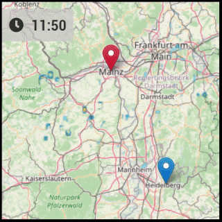

# MMM-RAIN-MAP

[](https://github.com/jalibu/MMM-RAIN-MAP/releases) [](https://snyk.io/test/github/jalibu/MMM-RAIN-MAP?targetFile=package.json)

A rain radar map for the [MagicMirror²](https://magicmirror.builders/) platform. Supports the [RainViewer API](https://www.rainviewer.com/) and [LibreWXR](https://github.com/JoshuaKimsey/LibreWXR).

Click here for the [Forum Thread](https://forum.magicmirror.builders/topic/12808/mmm-rain-map).

Contribution welcome.

## Support

If you also like this module and want to thank, please rate this repository with a star or [donate a small amount that is worth it to you](https://paypal.me/jalibu).

## Features

- Displays radar layers from RainViewer or LibreWXR on OpenStreetMap
  - Every 10 minutes a new weather snapshot is published
  - The snapshots of the last 2 hours are available, which show the weather events of the past
- LibreWXR can provide forecast frames and supports self-hosted deployments
- Option to place multiple markers on map
- Option for multiple, alternating map positions
- Option to only show in current rainy weather conditions. Works only together with [weather](https://github.com/MagicMirrorOrg/MagicMirror/tree/master/modules/default/weather) or [MMM-OpenWeatherForecast](https://github.com/jclarke0000/MMM-OpenWeatherForecast) as dependency.
- (Experimental) Option to hide other modules in case of rain in favor to get more space.

### Demos

 

## Installation

Navigate to the `MagicMirror/modules` directory and execute the following command

```sh
git clone https://github.com/jalibu/MMM-RAIN-MAP
```

## Configuration

### Configuration example

Add the module configuration into the `MagicMirror/config/config.js` file:

```javascript
    {
      module: "MMM-RAIN-MAP",
      position: "top_left",
      config: {
        animationSpeedMs: 800,
        colorizeTime: true,
        defaultZoomLevel: 6,
        displayTime: true,
        displayTimeline: true,
        displayClockSymbol: true,
        displayHoursBeforeRain: -1,
        extraDelayLastFrameMs: 2000,
        extraDelayCurrentFrameMs: 5000,
        invertColors: false,
        markers: [
          { lat: 49.41, lng: 8.717, color: "red" },
          { lat: 48.856, lng: 2.35, color: "green" }
        ],
        mapPositions: [
          { lat: 49.41, lng: 8.717, zoom: 7, loops: 1 },
          { lat: 49.41, lng: 8.717, zoom: 5, loops: 2 },
          { lat: 48.856, lng: 2.35, zoom: 5, loops: 1 },
          { lat: 48.856, lng: 2.35, zoom: 7, loops: 2 },
          { lat: 49.15, lng: 6.154, zoom: 4, loops: 2 }
        ],
        mapUrl: "https://a.tile.openstreetmap.de/{z}/{x}/{y}.png",
        provider: "rainviewer",
        // For a self-hosted LibreWXR instance, use:
        // provider: "librewxr",
        // providerUrl: "http://192.168.1.20:8080",
        mapHeight: "420px", // must be a pixel value (no percent)
        mapWidth: "420px", // must be a pixel value (no percent)
        maxHistoryFrames: 6,
        radarOpacity: 0.9,
        substituteModules: [],
        updateIntervalInSeconds: 600,
      },
    },
```

### Configuration options

| Option                     | Description                                                                                                                                                                                                                                                                                                                                                                                                                                                                                                                                                                                                                                                                                                                                                                                                                                                                             |
| -------------------------- | --------------------------------------------------------------------------------------------------------------------------------------------------------------------------------------------------------------------------------------------------------------------------------------------------------------------------------------------------------------------------------------------------------------------------------------------------------------------------------------------------------------------------------------------------------------------------------------------------------------------------------------------------------------------------------------------------------------------------------------------------------------------------------------------------------------------------------------------------------------------------------------- |
| `animationSpeedMs`         | Determines how fast the frames are played. <br><br>**Type:** `int` <br> **Default value:** `800` (time per frame in milliseconds)                                                                                                                                                                                                                                                                                                                                                                                                                                                                                                                                                                                                                                                                                                                                                       |
| `colorizeTime`             | Set true, to colorize the timestamps. <br><br>**Type:** `boolean` <br> **Default value:** `true`                                                                                                                                                                                                                                                                                                                                                                                                                                                                                                                                                                                                                                                                                                                                                                                        |
| `colorScheme`              | ⚠️ **RainViewer free API limitation**: only color scheme `2` (Universal Blue) is available. Other values are ignored and the module uses `2`.<br><br>**Type:** `number` <br> **Default value:** `2`                                                                                                                                                                                                                                                                                                                                                                                                                                                                                                                                                                                                                                                                                     |
| `defaultZoomLevel`         | Fallback/default zoom value that is used if it is not explicitly set in a MapPostion. <br><br>**Type:** `int`<br>**Range:** `0 (whole world) - 7 (city level)` — limited by RainViewer radar tile API<br> **Default value:** `6`                                                                                                                                                                                                                                                                                                                                                                                                                                                                                                                                                                                                                                                        |
| `displayTime`              | Set true, to display the time for each frame. <br><br>**Type:** `boolean` <br> **Default value:** `true`                                                                                                                                                                                                                                                                                                                                                                                                                                                                                                                                                                                                                                                                                                                                                                                |
| `displayClockSymbol`       | Set true, to display a clock symbol as time prefix. <br><br>**Type:** `boolean` <br> **Default value:** `true`                                                                                                                                                                                                                                                                                                                                                                                                                                                                                                                                                                                                                                                                                                                                                                          |
| `displayTimeline`          | Set true, to display a timeline. <br><br>**Type:** `boolean` <br> **Default value:** `true`                                                                                                                                                                                                                                                                                                                                                                                                                                                                                                                                                                                                                                                                                                                                                                                             |
| `displayHoursBeforeRain`   | This option allows, to show or hide the map depending on the expected or current weather situation. The allowed values and options depend on your weather module which feeds MMM-RAIN-MAP with weather conditions under the hood.<br/><br/><b>Supported modules and different functionality</b><br/>Basic options, provided by both modules: If set to `0` the map shows up on rain, if set to `-1` the map is always displayed.<br/><ul><li>[weather](https://github.com/MagicMirrorOrg/MagicMirror/tree/master/modules/default/weather)<br>When used with type `hourly` allowes you to use the weather forecast data and to display the map when rain is expected within a defined number of hours by setting a value greater `0`.</li><li>[MMM-OpenWeatherForecast](https://github.com/jclarke0000/MMM-OpenWeatherForecast)</li></ul>**Type:** `number` <br> **Default value:** `-1` |
| `extraDelayLastFrameMs`    | Add an extra delay to pause the animation on the last frame.<br><br>**Type:** `int` <br> **Default value:** `1000` (time in milliseconds)                                                                                                                                                                                                                                                                                                                                                                                                                                                                                                                                                                                                                                                                                                                                               |
| `extraDelayCurrentFrameMs` | Add an extra delay to pause the animation on the frame for the current weather situation.<br><br>**Type:** `int` <br> **Default value:** `5000` (time in milliseconds)                                                                                                                                                                                                                                                                                                                                                                                                                                                                                                                                                                                                                                                                                                                  |
| `invertColors`             | Option to invert the colors of the map tiles. Can be used to display the map in a kind of dark mode.<br><br>**Type:** `boolean` <br> **Default value:** `false`                                                                                                                                                                                                                                                                                                                                                                                                                                                                                                                                                                                                                                                                                                                         |
| `markers`                  | Optional list of markers on the map.<br> See examples and Markers-Object documentation below for details. <br><br>**Type:** `array[Marker]` <br> **Default value:** `Sample set`                                                                                                                                                                                                                                                                                                                                                                                                                                                                                                                                                                                                                                                                                                        |
| `mapPositions`             | **Required:** List of zoom/center positions for the map.<br> See examples and MapPosition-Object documentation below for details.<br>💡 **Tip:** You can get the latitude and longitude for your location from the URL bar at [openstreetmap.org](https://www.openstreetmap.org/). <br><br>**Type:** `array[MapPosition]` <br> **Default value:** `Sample set`                                                                                                                                                                                                                                                                                                                                                                                                                                                                                                                          |
| `mapHeight`                | Height of the map. Must be string with pixels and "px" postfix. Percentage values won't work.<br><br>**Type:** `string` (pixels) <br> **Default value:** `'420px'`                                                                                                                                                                                                                                                                                                                                                                                                                                                                                                                                                                                                                                                                                                                      |
| `mapWidth`                 | Width of the map. Must be a string with pixels and "px" postfix. Percentage values won't work.<br><br>**Type:** `string` (pixels) <br> **Default value:** `'420px'`                                                                                                                                                                                                                                                                                                                                                                                                                                                                                                                                                                                                                                                                                                                     |
| `mapUrl`                   | Option to use an alternative map. In most cases you are fine with the default but you can find more maps [here](https://wiki.openstreetmap.org/wiki/Tile_servers).<br><br>**Type:** `string`<br> **Default value:** `'https://a.tile.openstreetmap.de/{z}/{x}/{y}.png'`<br>**Official OSM server:** `'https://tile.openstreetmap.org/{z}/{x}/{y}.png'`<br>**Alternative uncolored map:** `'https://tiles.wmflabs.org/bw-mapnik/{z}/{x}/{y}.png'`                                                                                                                                                                                                                                                                                                                                                                                                                                        |
| `provider`                 | Radar data provider.<br><br>**Possible values:** `'rainviewer'`, `'librewxr'`<br>**Type:** `string`<br> **Default value:** `'rainviewer'`<br><br>LibreWXR uses `https://api.librewxr.net` by default. Set `providerUrl` to use a local or self-hosted LibreWXR instance.                                                                                                                                                                                                                                                                                                                                                                                                                                                                                                                                                                                                                |
| `providerUrl`              | Base URL for a LibreWXR instance. Only used when `provider` is `'librewxr'`.<br><br>**Type:** `string`<br> **Default value:** `'https://api.librewxr.net'`                                                                                                                                                                                                                                                                                                                                                                                                                                                                                                                                                                                                                                                                                                                              |
| `maxHistoryFrames`         | Maximum number of history frames. There is one frame every 10 minutes. Setting this to 6 would show history radar layers of the last hour until now. If set to -1, all available history frames are shown.<br>As of today, the **API provides 12 history frames** -> 2h.<br><br>**Type:** `int` <br> **Default value:** `6` (1 hour of history to reduce API load)                                                                                                                                                                                                                                                                                                                                                                                                                                                                                                                      |
| `maxForecastFrames`        | ⚠️ **CURRENTLY UNAVAILABLE**: RainViewer's free API no longer provides forecast/nowcast data.<br><br>**Type:** `int` <br> **Default value:** `0`                                                                                                                                                                                                                                                                                                                                                                                                                                                                                                                                                                                                                                                                                                                                        |
| `radarOpacity`             | Controls the opacity of the radar layer. Lower values make the radar less prominent over the map.<br><br>**Type:** `number` <br> **Range:** `0` (transparent) - `1` (fully opaque)<br> **Default value:** `1`                                                                                                                                                                                                                                                                                                                                                                                                                                                                                                                                                                                                                                                                           |
| `substituteModules`        | (Experimental) If `displayHoursBeforeRain` is set to `0` or higher, you can define a list of module names that are hidden in favor of the map. <br><br>**Type:** `array[string]` <br> **Default value:** `[]` <br> **Example:** `['MMM-Jast', 'calendar']`<br>Legacy alias: `substitudeModules` (deprecated)                                                                                                                                                                                                                                                                                                                                                                                                                                                                                                                                                                            |
| `timeFormat`               | Option to override the MagicMirror's global time format to 12 or 24 for this module. <br><br>**Type:** `int` <br> **Default value:** `[Global Config]` or `24`                                                                                                                                                                                                                                                                                                                                                                                                                                                                                                                                                                                                                                                                                                                          |
| `updateIntervalInSeconds`  | Update interval for fetching new radar frames from the RainViewer.com API. (New frames are released every 10 minutes) <br><br>**Type:** `int` <br> **Default value:** `600` (10 minutes in seconds to align with API update frequency)                                                                                                                                                                                                                                                                                                                                                                                                                                                                                                                                                                                                                                                  |

Forecast availability depends on the selected provider. RainViewer's free API currently does not provide forecast frames, while LibreWXR can provide them when available from its configured data sources.

### Providers

RainViewer is used by default:

```javascript
provider: 'rainviewer'
```

To use the public LibreWXR service:

```javascript
provider: 'librewxr'
providerUrl: 'https://api.librewxr.net'
```

To use a self-hosted LibreWXR instance, set `providerUrl` to its base URL:

```javascript
provider: 'librewxr'
providerUrl: 'http://192.168.1.20:8080'
```

`providerUrl` is only used with `provider: "librewxr"`. Both providers use the same frame format, so the remaining module configuration is unchanged.

## Update the module

Just enter the module's directory, pull the update and install the dependencies:

```bash
cd ~/MagicMirror/modules/MMM-RAIN-MAP
git pull
```

### Marker Object

Markers are **visual pin icons** placed on the map at specific coordinates. They are purely decorative and do not define the visible map area. A typical use case is marking your home and workplace so you can easily spot them while watching the rain radar.

| Option  | Description                                                                                                                               |
| ------- | ----------------------------------------------------------------------------------------------------------------------------------------- |
| `lat`   | **Required:** Marker's latitude.<br><br>**Type:** `float`                                                                                 |
| `lng`   | **Required:** Marker's longitude.<br><br>**Type:** `float`                                                                                |
| `color` | Marker's color.<br><br>**Possible values:** `'black','blue','gold','green','grey','orange','red','violet','yellow'`<br>**Type:** `string` |

### MapPosition Object

Map positions define the **visible map area** — where the map is centered and at what zoom level. The map cycles through all configured positions, staying at each one for the configured number of animation loops.

| Option  | Description                                                                                                                                                            |
| ------- | ---------------------------------------------------------------------------------------------------------------------------------------------------------------------- |
| `lat`   | **Required:** Position's latitude.<br><br>**Type:** `float`                                                                                                            |
| `lng`   | **Required:** Position's longitude.<br><br>**Type:** `float`                                                                                                           |
| `zoom`  | Either set a zoom level or defaultZoomLevel is used.<br><br>**Range:** `0 (whole world) - 7 (city level)` — limited by RainViewer radar tile API<br>**Type:** `number` |
| `loops` | Number of loops/iterations until the map moves to the next position. If no number is set, a value of `1` is used.<br><br>**Type:** `number`                            |

## Contribution and Development

This module is written in TypeScript and compiled with Rollup.
The source files are located in the `/src` folder.
Compile target files with `node --run build`.

Contribution for this module is welcome!

## Thanks to

- Thanks to all supporters who gave a small [donation](https://www.buymeacoffee.com/jalibu) out of gratitude for my work.
- All testers for their feedback.
- [MMM-RAIN-RADAR by jojoduquartier](https://github.com/jojoduquartier/MMM-RAIN-RADAR) for inspiration.

## License

This project is licensed under the MIT License - see the [LICENSE](LICENSE.md) file for details.

## Changelog

All notable changes to this project will be documented in the [CHANGELOG.md](CHANGELOG.md) file.
